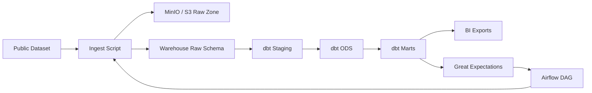

# Architecture

## Components
- **Ingest**: Python 3.11 script downloads NYC TLC sample data, writes partitioned parquet to S3/MinIO, and loads raw tables into the warehouse.
- **Warehouse**: Postgres (local) as a Redshift-compatible target. Switchable to Redshift or Databricks SQL.
- **Transformations**: dbt models for staging, ods, and marts.
- **Validation**: dbt tests + Great Expectations suites.
- **Orchestration**: Airflow DAG `analytics_eng_e2e`.
- **BI Outputs**: CSV exports for QuickSight/Tableau/Power BI.
