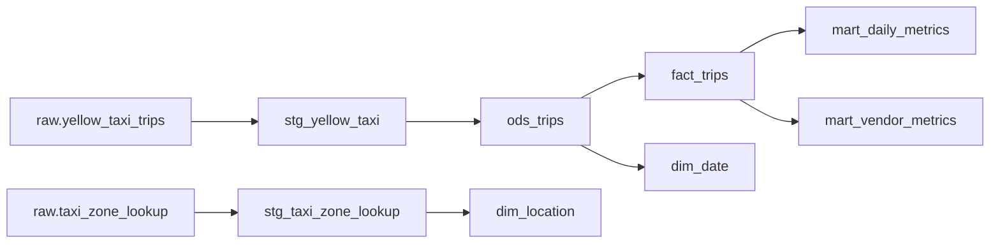

# Lineage

```mermaid
flowchart LR
    A[raw.yellow_taxi_trips] --> B[stg_yellow_taxi]
    A2[raw.taxi_zone_lookup] --> C[stg_taxi_zone_lookup]
    B --> D[ods_trips]
    D --> E[fact_trips]
    C --> F[dim_location]
    D --> G[dim_date]
    E --> H[mart_daily_metrics]
    E --> I[mart_vendor_metrics]
```
